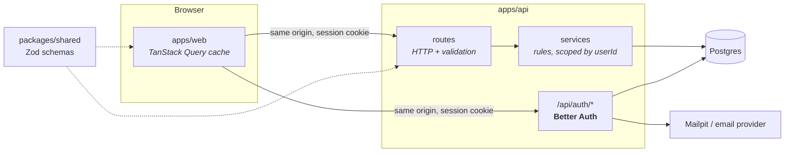

# Architecture

How Verso is put together and why. For what it does and how to run it, see the
[README](README.md). For what's next, see [TODO.md](TODO.md).

## The shape of it

Verso is an npm workspaces monorepo with three packages:

| Package           | What it is                                                          |
| ----------------- | ------------------------------------------------------------------- |
| `apps/web`        | The React app (Vite, Tailwind, React Router, TanStack Query)        |
| `apps/api`        | The Hono API on Node: auth, data, and later every AI call           |
| `packages/shared` | Zod schemas for every entity, the single definition of the contract |



In development the browser only ever talks to Vite on `:5173`, which proxies
`/api` to the API on `:3000`. In production one domain serves both. Either
way the browser sees a single origin — which is what makes cookie auth simple.

## The shared contract

`packages/shared` defines `Task`, `Project` and their inputs as Zod schemas.
Both sides use the same schema for different jobs:

- **The API validates** every request body against it at runtime
  (`validate('json', createTaskInput)`), and rejects unknown keys — inputs are
  `z.strictObject`, so a client sending `done` instead of `completed` gets a
  400 rather than having the field silently dropped.
- **The web app parses** every response with it (`lib/api.ts`), and its
  TypeScript types are inferred from it (`z.infer`). If a deployed API and a
  cached old frontend ever disagree, the parse fails loudly at the boundary
  instead of rendering `undefined` three components later.

The package is consumed as TypeScript source (`"exports": "./src/index.ts"`),
with no build step: Vite and `tsx` both compile it on the fly.

**Why not Hono's typed RPC client (`hc`)?** It would give compile-time checking
of route paths, but importing the API's route types into the web app pulls the
API's source into the web typecheck — including Node's globals, so
`process.env.SECRET` in a React component would typecheck. Seven routes are
cheap to keep in sync by hand; runtime-validated responses are the stronger
guarantee.

## The API: routes → services → db

```
apps/api/src/
  app.ts            the Hono app: mounts auth and routes, maps errors
  index.ts          starts the server (kept apart so tests can import app)
  env.ts            every env var, parsed with Zod at startup
  auth/             Better Auth config + requireSession middleware
  routes/           HTTP only: session, validation, status codes
  services/         the rules; every function takes userId first
  db/               Drizzle schema, client, migration runner
  email/            mailer (Mailpit in dev, in-memory outbox in tests)
  drizzle/          generated SQL migrations — committed, never hand-edited
```

**Routes** check the session (`requireSession`), validate input, call one
service function and choose a status code. Nothing else.

**Services** hold every rule — "a task's project must be yours", "subtasks are
one level deep", "completing twice keeps the first completion time". They
throw `NotFoundError` or `InvalidInputError` (`errors.ts`), and `app.onError`
is the one place those become 404 and 400. Services know nothing about HTTP.

That separation is the reason logic lives in this API rather than in a
backend-as-a-service: in Step 5 the AI chat's tools call **the same service
functions** as the routes. "The AI marks a task done" and "the checkbox marks
a task done" go through one code path, with one set of ownership checks.

### Ownership is enforced twice

Every service function takes `userId` as its first argument and puts it in
every `WHERE`. Another user's row is a **404, not a 403** — a 403 would confirm
the id exists.

The database backs this up. `tasks` has **composite foreign keys**:
`(project_id, user_id) → projects(id, user_id)` and the same for `parent_id`.
Postgres itself refuses to attach a task to another user's project or parent,
even if a service check were ever missed. `src/db/schema.test.ts` tests these
constraints directly, asserting the specific Postgres error code (`23503`).

### Deletion

- Deleting a **user** cascades to their projects, tasks and sessions — account
  deletion (a GDPR requirement) is one `DELETE`.
- Deleting a **parent task** cascades to its subtasks.
- Deleting a **project** that still has tasks is refused (`NO ACTION`). What
  should happen to those tasks is undecided; the constraint keeps it from being
  decided by accident. `NO ACTION` rather than `RESTRICT` because it is checked
  at the end of the statement, so a user deletion that removes both the project
  and its tasks in one cascade still succeeds.

## Data model

Designed for all five roadmap steps; Step 1 created `projects`, `tasks` and
Better Auth's tables. Later steps add tables rather than restructuring these.

```ts
type Task = {
  id: string // uuid
  userId: string
  projectId: string | null
  parentId: string | null // subtask of; one level deep
  title: string
  notes: string
  kind: 'task' | 'assignment'
  dueAt: string | null // the deadline
  scheduledAt: string | null // when you plan to work on it
  estimateMinutes: number | null
  completedAt: string | null // null while open
  position: number // order among siblings
  source: 'user' | 'ai_breakdown' | 'ai_chat'
  createdAt: string
  updatedAt: string
}
```

The choices that aren't obvious:

- **`dueAt` and `scheduledAt` are separate.** When something is due and when
  you'll work on it are different facts, and the gap between them is what
  planning is. The AI daily plan (Step 4) is essentially choosing `scheduledAt`
  values given `dueAt` values.
- **`completedAt`, not `done`.** Same information plus _when_, which can't be
  recovered later and which the daily plan needs. The client sends
  `{ completed: true }` and the **server** stamps the time with its own clock,
  the same way it owns `createdAt` and `updatedAt`.
- **An assignment is a task** (`kind: 'assignment'`) and **a course is a
  project** (`kind: 'course'`, with details in a future `courses` table). Every
  task and project feature works for them with no special cases.
- **Subtasks are tasks with a `parentId`.** AI breakdown (Step 2) inserts
  ordinary tasks with `source: 'ai_breakdown'`; kept suggestions are real,
  editable tasks.
- **`source` is set by the server**, never the request body: the route a
  request came through decides it.
- **Timestamps are `timestamptz` in Postgres and ISO strings everywhere
  else.** Postgres stores an instant; the client decides which timezone to show
  it in. Better Auth's generated tables used plain `timestamp` and were edited
  to match (see the header of `src/db/authSchema.ts`).

## Auth

[Better Auth](https://better-auth.com) runs inside the API at `/api/auth/*` and
stores users, sessions, accounts and verification tokens in our Postgres.

- **Email and password**, minimum 10 characters, hashed by Better Auth
  (scrypt).
- **Email verification is required** before a session is issued. The emailed
  link goes to `/api/auth/verify-email`, which signs the user in and redirects
  to `/login`, which forwards a signed-in user to the app.
- **Password reset** emails a link that redirects to `/reset-password?token=…`.
  A reset **revokes every other session** — if the reset happened because the
  password leaked, those sessions may not be the owner's.
- **Sessions are httpOnly cookies**, not tokens in localStorage: page
  JavaScript can't read them, so an XSS bug can't steal them, and they live in
  the database, so they can be revoked instantly.
- **Rate limiting** on the auth endpoints is stored in Postgres (so it survives
  restarts and is shared across instances) and is on in production only.
- **Sign-up can't be used to discover accounts**: signing up with an existing
  address and requesting a reset for an unknown one both answer exactly like
  the normal case.

`requireSession` (`src/auth/requireSession.ts`) turns the cookie into a
`userId` on the Hono context, typed through `AuthedEnv`, or responds 401.

## The web app

### Server state lives in TanStack Query

`useTasks` and `useProjects` no longer hold state — they read and write
TanStack Query's cache. Every component calling `useTasks` reads the same
cached list, which removes the old problem of each caller holding its own
copy.

- **Updates and deletes are optimistic.** The cache changes immediately; if
  the request fails, it rolls back to the snapshot taken just before.
  `applyPatch.ts` mirrors what the server does with a patch, and is tested.
- **Overlapping changes resync.** Rolling back one change can restore a
  snapshot that predates another in-flight one, so once the _last_ in-flight
  task mutation settles (counted via a shared `mutationKey`), the list is
  refetched from the server.
- **Creates are not optimistic**: the server assigns the id.
- **A 401 anywhere** refetches the session, so `RequireAuth` redirects to
  `/login` — wherever the 401 came from.
- **Signing out clears the whole cache**, so the next person on the same
  browser never sees a flash of the previous user's tasks.

### Auth without cross-feature imports

Features never import other features, but the tasks feature needs to sign
out. `lib/authClient.ts` uses Better Auth's framework-agnostic client (no
React), so it is allowed in `lib/` and any feature can call it. Session _state_
is a TanStack Query entry under one shared key: `app/RequireAuth` reads it,
sign-in and sign-out invalidate it.

`RequireAuth` is a convenience, not the security boundary. The API refuses
data requests without a session regardless of what the browser shows.

### Layering

| Layer         | Contains                        | Rule                                               |
| ------------- | ------------------------------- | -------------------------------------------------- |
| `app/`        | Shell, router, providers, guard | Every route is declared here, and only here        |
| `features/`   | One folder per domain           | A feature never imports another feature            |
| `components/` | Shared UI                       | No domain knowledge — must not know what a Task is |
| `lib/`        | Pure functions, API clients     | No React: no hooks, no JSX, no component imports   |

## Lists are not mutually exclusive

The rule most likely to look like a bug: a task can appear in more than one
list at once. Completing a task that is due today leaves it in **Today**,
struck through, as well as putting it in **Completed**. Checking something off
should not make it disappear out from under you.

So `grouping.ts` has two functions: `classify(task, now)` returns the
**single** list a task primarily belongs to (for the detail panel's label),
and `isInList(task, key, now)` answers "should this show up here?" and may say
yes to several. Collapsing them is the obvious-looking simplification, and it
is wrong.

**Overdue** (`isOverdue`) means open and past `dueAt`. A completed task is
never overdue, even if it was finished late. The row says "overdue" in brighter
text — no red, no warning icon: noticed, not scolded.

## Time is local

Every function in `lib/time.ts` reads local-time getters, because every one of
them exists to put something in front of a person, and people are in a
timezone. The consequences:

- **Test fixtures** are built from local components,
  `new Date(2026, 8, 3, 14, 30)`, never from a UTC string, or the test passes
  only in the timezone it was written in. The month is 0-indexed.
- `toISOString().slice(0, 10)` looks like a date key and is wrong near
  midnight, because it is UTC. Use `toDateKey`.
- The server stores instants and never needs to know the user's timezone —
  until Step 4, when "today's plan" is computed server-side and the user gets a
  `timezone` column.

## The day rail, and the one inline-style exception

`DayRail` positions hour ticks, task marks and the now-line at percentages
computed from task data at runtime. Tailwind only generates classes for values
written literally in source, so it can't express `left: 43.75%`. This is the
one component permitted a `style` prop; everything else in it still comes from
tokens. The window covers 06:00–22:00 and widens to whole hours when a task or
the current time falls outside it.

## Styling

Tailwind v4, configured in CSS: the design tokens are an `@theme` block in
`apps/web/src/styles/index.css`, and each token becomes utilities
automatically (`--color-ink` → `bg-ink`, `text-ink`…). Components use tokens
only; a raw hex is a bug, because one colour would then have two sources of
truth. Near-black surfaces, bone-white text, no accent colour — white is the
accent, used sparingly.

## Testing

Three suites, all run by `npm test` at the root:

- **`apps/web`** — the pure modules: `lib/time.ts`, `grouping.ts` (list
  membership, the midnight boundary, overdue), `applyPatch.ts` (what an
  optimistic update does). No DOM needed.
- **`packages/shared`** — the schemas' less obvious rules: trimming, strict
  inputs, `completed` rather than `completedAt`, timestamps with offsets.
- **`apps/api`** — integration tests against a real Postgres:
  - `db/schema.test.ts` tests the database's own constraints.
  - `auth/auth.test.ts` drives the real sign-up → email → verify and reset
    flows; emails land in an in-memory outbox that tests read links out of.
  - `routes/*.test.ts` cover 401s, ownership (user B gets 404 on user A's
    rows), validation, and parse every response with the shared schemas.

The API tests call `app.request(...)` — the full middleware and routing stack,
in memory, with no port. They use a separate `verso_test` database, which the
global setup **drops and rebuilds from the migrations on every run** — a clean
slate, and a standing proof that the migrations apply to an empty database.
Test files run one at a time, since they share that database.

## Known limitations

- **Sign-out is in the sidebar, which is hidden below the `md` breakpoint.** On
  a phone there's no way to sign out yet. Mobile navigation is a design
  decision that hasn't been made.
- **Projects can be renamed through the API but not in the UI**, and can't be
  deleted at all (see Deletion above).
- **A failed update rolls back silently.** The change visibly reverts, but
  nothing says why. Needs a small, consistent error surface.
- **`formatWhen` omits the year**, so a deadline more than a year away reads
  like this year's date.
- **Not deployed.** No production Dockerfile, no real email provider, and
  `advanced.ipAddress` for rate limiting behind a proxy isn't configured.
- **`npm audit` reports four moderate issues** in the esbuild bundled inside
  `drizzle-kit`. They concern esbuild's dev server, which drizzle-kit never
  starts, and drizzle-kit is dev-only. `npm audit fix --force` would downgrade
  drizzle-kit by a year; don't.
