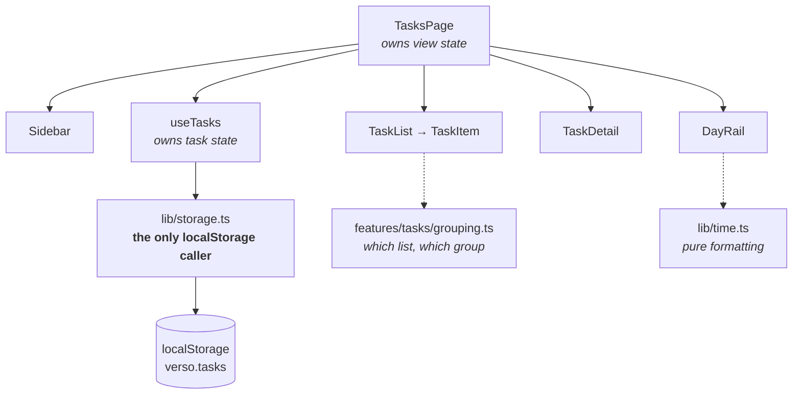

# Architecture

How Verso is put together and why. For what it does and how to run it, see the
[README](README.md).

## The shape of it

Verso is a single-route React app with no server. State lives in React, is
persisted to `localStorage` on every change, and is read back once on load.



Solid arrows are data flowing down through props; dotted arrows are calls into
pure modules.

## Layering

Four layers, with one rule each. The rules exist to keep the app from turning
into a mesh where everything imports everything.

| Layer         | Contains              | Rule                                               |
| ------------- | --------------------- | -------------------------------------------------- |
| `app/`        | Shell, router         | Every route is declared here, and only here        |
| `features/`   | One folder per domain | A feature never imports another feature            |
| `components/` | Shared UI             | No domain knowledge — must not know what a Task is |
| `lib/`        | Pure functions        | No React: no hooks, no JSX, no component imports   |

The `lib/` rule is the load-bearing one. Because `lib/time.ts` has no React in
it, its functions can be called directly from a test with no renderer, no DOM
and no setup. The same goes for `features/tasks/grouping.ts`, which is pure
despite living in a feature folder — it is domain logic, so it belongs to the
domain, but it takes data in and returns data out.

The `features/` rule is what would keep an `auth` feature from tangling with
`tasks` later. Anything both need moves down a layer rather than sideways.

## Persistence is a boundary, not a detail

`src/lib/storage.ts` is the only module in the codebase that names
`localStorage`. Nothing else — no component, no hook — touches it.

```ts
const TASKS_KEY = 'verso.tasks'

export function getTasks(): Task[] { ... }
export function saveTasks(tasks: Task[]): void { ... }
```

Two functions, both dumb: read the whole list, write the whole list. All the
mutation logic — adding, toggling, patching — lives in `useTasks`, above the
boundary.

This is deliberate and it is the single most important structural decision in
the project. Swapping `localStorage` for a real backend means rewriting the
bodies of these two functions and making them async. It does not mean touching a
single component, because no component knows where data comes from.

### Corrupt data does not white-screen the app

`JSON.parse` throws on malformed input. If it threw here, it would throw on
every load, and the app would be permanently stuck on a blank screen with no way
to recover short of opening devtools.

So the parse is wrapped, and the unreadable value is **moved aside rather than
discarded** — copied to a second key, `verso.tasks.corrupt`, before starting
from empty. The app recovers on its own, and the data is still there to be
salvaged by hand.

### The one `as` cast

The project bans `as` casts. There is exactly one, and it is here:

```ts
return Array.isArray(parsed) ? (parsed as Task[]) : []
```

`JSON.parse` returns `unknown`, so this is the one point where untyped data
enters the type system — every boundary has one. The `Array.isArray` guard
checks the shape as far as is worth checking, given that nothing but
`saveTasks` ever writes to this key. A full runtime validator would be the
correct answer for data crossing a network; for a key only this app writes, it
would be ceremony.

It is commented in place, so the next person to read it knows it was a decision
and not an oversight.

## Data model

```ts
type Task = {
  id: string
  userId: string
  title: string
  notes: string
  projectId: string | null
  scheduledAt: string | null // ISO 8601
  estimateMinutes: number | null
  done: boolean
  createdAt: string
  updatedAt: string
}
```

Two things here are forward-looking on purpose.

**`userId` exists although there is no auth.** It is always
`CURRENT_USER_ID`, a placeholder constant in `src/lib/currentUser.ts`. Carrying
an owner from the first commit means adding real accounts later changes one
constant and the storage layer, rather than requiring a migration over every
task ever created. The cost today is one unused field; the cost of adding it
later would be much higher.

**`projectId` exists although projects do not.** Same reasoning, though the
feature itself is still unbuilt.

**Dates are ISO 8601 strings in storage, never `Date` objects.** `Date` does not
survive `JSON.stringify` round-tripping as a `Date` — it comes back a string —
so storing one guarantees a type lie. Conversion happens at the edges: on the
way into an input, and on the way back out.

## Updates go through one function

`useTasks` exposes `addTask`, `toggleDone`, `deleteTask`, and:

```ts
export type TaskPatch = Partial<
  Omit<Task, 'id' | 'userId' | 'createdAt' | 'updatedAt'>
>

function updateTask(id: string, patch: TaskPatch) { ... }
```

`Partial` makes every field optional, so a caller passes only what changed.
`Omit` removes the four fields nothing outside the hook may set — identity and
timestamps are the hook's to manage, and `updatedAt` is stamped on every patch.

The alternative was a setter per field (`setScheduledAt`, `setTitle`,
`setNotes`, …), which is what existed first. Replacing them with one typed patch
meant that adding in-place editing for title, notes and estimate later was
wiring rather than three new functions.

## Lists are not mutually exclusive

The rule most likely to look like a bug in the code, so it is worth stating: a
task can appear in more than one list at once.

Completing a task that is due today leaves it in **Today**, struck through, as
well as putting it in **Completed**. Checking something off should not make it
disappear out from under you.

This is why there are two separate functions in `grouping.ts` rather than one:

- `classify(task, now)` returns the **single** list a task primarily belongs to,
  where `done` always wins. It is used for the one-line label in the detail
  panel, where only one answer fits.
- `isInList(task, key, now)` answers **"should this show up here?"** for a given
  list, and is free to say yes to several.

Collapsing these into one function is the obvious-looking simplification and it
is wrong.

The boundary between Today and Upcoming is end-of-today, not `isSameDay` — an
overdue task surfaces in Today rather than silently vanishing into the past.

## Time is local

Every function in `lib/time.ts` reads local-time getters — `getHours`,
`getDate`, `getFullYear` — because every one of them exists to put something in
front of a person, and people are in a timezone.

The consequence matters for anyone writing tests here: **fixtures must be built
from local components**, `new Date(2026, 8, 3, 14, 30)`, and never from a UTC
string like `new Date('2026-09-03T14:30:00Z')`. A UTC literal produces a test
that passes only in the timezone it was written in. The month argument is
0-indexed, so `8` is September.

The same trap applies in application code: `toISOString().slice(0, 10)` looks
like a reasonable way to get a date key and is wrong near midnight, because it
is UTC.

## The day rail, and the other documented exception

`DayRail` positions hour ticks, task marks and the now-line at percentages
computed from task data at runtime. Tailwind generates classes only for values
written literally in source, so it cannot express `left: 43.75%` when `43.75`
came from a task's scheduled time.

This is the one component permitted to use a `style` prop, and the reason is
commented at the top of the file. Everything else in it — colour, size, spacing
— still comes from tokens.

Two behaviours are worth noting:

- **The window widens.** The rail covers 06:00–22:00 by default, but stretches
  out to whole hours when a task or the current time falls outside that. Before
  this, a task at 23:30 was positioned at 109% — off the end of the rail and
  invisible.
- **The now-line moves** because `now` is held in state and re-set on a
  30-second interval. A value computed during render would be frozen at mount.

## Styling

Tailwind v4, configured entirely in CSS. There is no `tailwind.config.js`; the
design tokens live in an `@theme` block in `src/styles/index.css`:

```css
@theme {
  --color-ink: #09090b;
  --color-bone: #edebe6;
  --color-hairline: rgba(255, 255, 255, 0.075);
  ...
}
```

Tailwind turns each token into utilities automatically — `--color-ink` becomes
`bg-ink`, `text-ink`, `border-ink`. Components reference tokens only; a raw hex
or an arbitrary value like `bg-[#09090B]` in a component is a bug, because it
means one colour has two sources of truth.

The palette is near-black surfaces and bone-white text with no accent colour.
White _is_ the accent, used sparingly — primary buttons, the now-line, a checked
checkbox. No gradients, no shadows.

## Testing strategy

Tests cover `lib/time.ts` and `features/tasks/grouping.ts` and nothing else.
That is a deliberate line, not an unfinished job.

Those two modules are pure, they hold all the logic that has actually broken,
and they need no DOM — Vitest reads the existing `vite.config.ts`, and there is
no jsdom and no separate config. The components are mostly layout and prop
wiring, where a rendering test would mostly assert that JSX is still JSX.

`describe`/`it`/`expect` are imported explicitly rather than enabled as globals,
which is why `tsc -b` typechecks the test files with no `types` entry in
`tsconfig`.

The suite encodes the bugs that have already happened, which is the useful
thing for it to do: undated tasks reaching a bucket that renders them,
completed tasks staying in Today, and the midnight boundary between Today and
Upcoming.

## Known limitations

- **`useTasks` holds state in a plain `useState`.** Every caller gets its own
  independent copy that overwrites the others on save. `TasksPage` is the only
  caller today, so it works — but the next component that needs task data will
  break it. This must be lifted into a context before projects or a command
  palette can be built, and it is the first item flagged in [TODO.md](TODO.md).
- **The layout is desktop-only.** A fixed three-column grid crushes below
  roughly 900px.
- **No accounts, no sync, no server.** Data lives in one browser.
